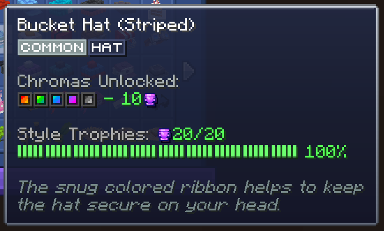
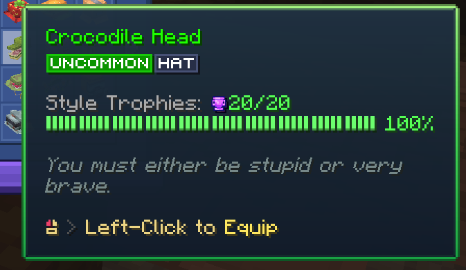
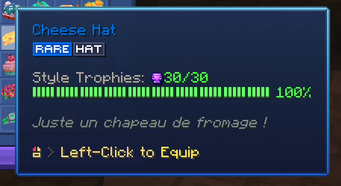
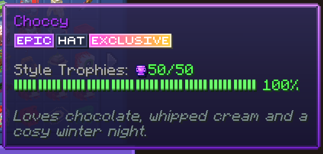
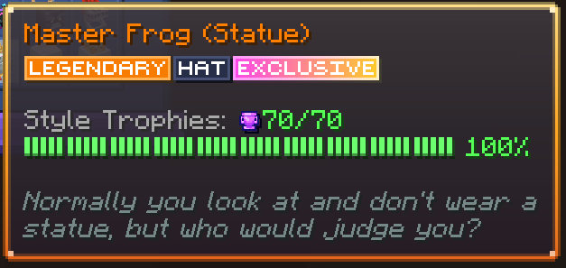
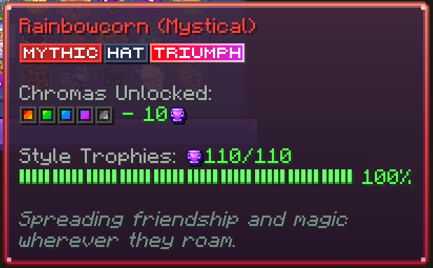
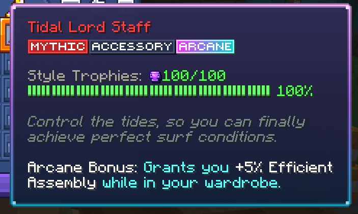
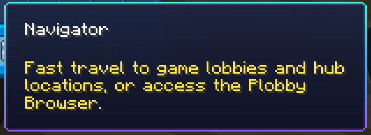

# MCC Island Tooltips

A client-side Fabric mod that gives items on [MCC Island](https://mccisland.net) fancy tooltip borders matching their
rarity.

## What it does

While you are connected to MCC Island, the mod looks at each item's lore for the rarity icons the server puts there and
swaps the plain vanilla tooltip for a styled one:

|                Common                |                 Uncommon                 |               Rare               |               Epic               |
|:------------------------------------:|:----------------------------------------:|:--------------------------------:|:--------------------------------:|
|  |  |  |  |

|                 Legendary                  |                Mythic                |                Arcane                |                Default                 |
|:------------------------------------------:|:------------------------------------:|:------------------------------------:|:--------------------------------------:|
|  |  |  |  |

Items without a rarity get a subtle MCC-flavored default border, so every tooltip on the Island fits the theme.

## Installation

1. Install the [Fabric Loader](https://fabricmc.net/use/) for Minecraft 26.1.2 or 26.2.
2. Drop the [Fabric API](https://modrinth.com/mod/fabric-api) and this mod's jar into your `mods` folder.
3. Join MCC Island and hover over something shiny.

## Building from source

The repository does not ship Gradle wrapper scripts; use a local Gradle installation matching
`gradle/wrapper/gradle-wrapper.properties` with Java 25:

```
gradle build
```

The built jar ends up in `build/libs/`.

## Credits

- The glyph-based rarity detection approach is inspired by [Pe3ep's Trident mod](https://modrinth.com/mod/trident-mcci).
- All MCC Island names, icons and designs belong to [Noxcrew](https://noxcrew.com/). This project is not affiliated with
  or endorsed by Noxcrew.

## License

This project is licensed under the [MIT License](LICENSE.txt).